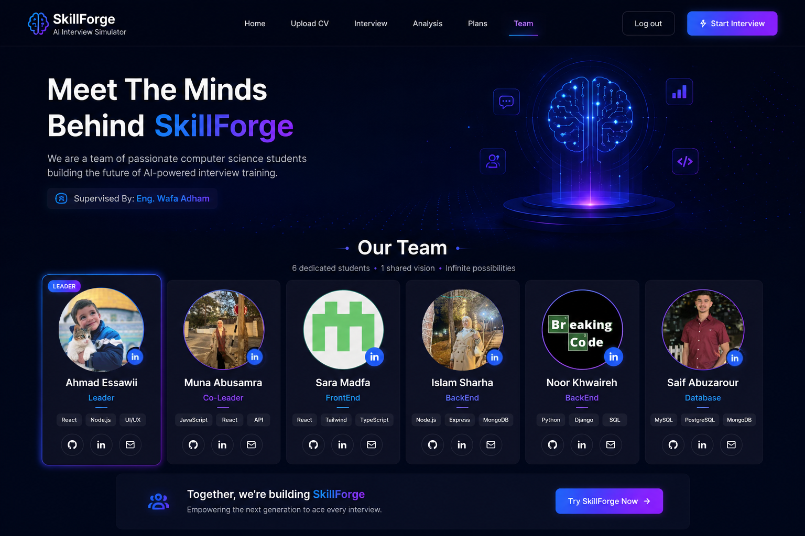

# ✨ SkillForge – AI Interview Simulator

> Smart AI-powered platform for realistic interview practice, personalized feedback, and career preparation.

---




## 📌 Overview

**SkillForge** is an intelligent interview simulation platform designed to help students, graduates, and job seekers prepare for real-world job interviews using Artificial Intelligence.

The platform generates personalized interview questions based on the user’s CV and target job role, analyzes responses, and provides instant AI-powered feedback to improve confidence, communication, and technical performance.

---

## 🎯 Problem Statement

Many job seekers struggle with:

- Interview anxiety and stress
- Lack of realistic interview practice
- Limited access to career coaching
- Generic interview questions
- No personalized feedback systems

SkillForge solves these problems through a smart AI-driven interview experience.

---

## 💡 Solution

SkillForge provides:

- 🤖 AI-powered interview simulation
- 📄 CV-based personalized questions
- 📊 Real-time answer evaluation
- 🧠 Strength & weakness analysis
- 📈 Performance analytics dashboard

---

## ✨ Main Features

### 👤 User Features

- Upload CV
- Select target job position
- Start AI-generated interviews
- Receive instant feedback
- View interview analytics
- Practice mock interviews based on your subscription plan

### 🧠 AI Features

- Personalized question generation
- AI answer evaluation
- Communication analysis
- Technical accuracy scoring
- Confidence assessment

### 🛠️ Admin Features

- Manage users
- Edit/Delete/Update accounts
- Dashboard analytics
- System monitoring

---

## 🧑‍💻 Tech Stack

### Frontend
- React.js
- Bootstrap / CSS
- React Router

### Backend
- Node.js
- Express.js

### Database
- MySQL / Sequelize

### AI Integration
- OpenAI API / GROQ API 

### Version Control
- Git & GitHub

---

## 🏗️ System Architecture

```bash
Frontend (React)
       ↓
Backend API (Node.js + Express)
       ↓
Database (MySQL)
       ↓
AI Services (OpenAI API / GROQ API )
```

---

## 🎯 Target Audience

- University students
- Fresh graduates
- Job seekers
- Junior & mid-level professionals
- Career changers

---

## 💰 Business Model

### Subscription Plans
- Free Plan (3 limited interviews)
- Pro Plan ($29/month Unlimited interviewsv)


### Institutional Licensing
- Universities
- Training Centers
- Bootcamps

### Corporate Packages
- Candidate screening
- Employee interview training

---

## 📈 Future Improvements

- 🎤 Voice interview simulation
- 🎥 Video interview support
- 🌍 Multi-language support
- 📑 ATS simulation
- 🧭 Career path recommendations

---

## 🚀 Installation

### 1️⃣ Clone Repository

```bash
git clone https://github.com/your-username/skillforge.git
cd skillforge
```

### 2️⃣ Install Dependencies

```bash
npm install
```

### 3️⃣ Run Backend

```bash
npm start
```

### 4️⃣ Run Frontend

```bash
npm run dev 
```


## 🔐 License

This project is developed for educational and training purposes.

---

## 🌟 Vision

Our goal is to make interview preparation smarter, easier, and accessible for everyone using the power of Artificial Intelligence.

